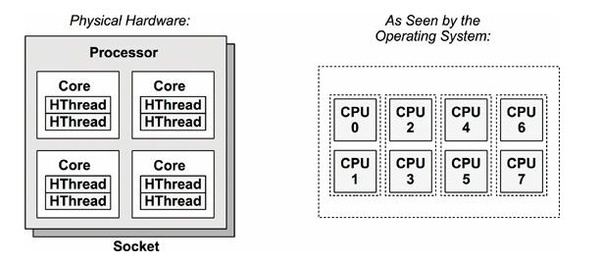

# Connecting to the supercomputing cluster

Author: Cintia Gómez-Muñoz

Created: May 1, 2019

Updated: June 1, 2021

---

## What is a supercomputer?

As many of us would like to think, a computer is to a supercomputer, as a man is to Superman. This analogy is not completely wrong, as a supercomputer works in almost the same way as a regular computer, but faster and with more storage capabilities. Despite this, in the broader meaning of the prefix '[super](http://www.english-for-students.com/Prefix-SUPER.html)', a supercomputer can be seen as a bunch of computers built on 'top of each other', or connected through a network. Each computer is called a **node** and the junction of all computers is known as a **cluster**. Such connectivity allows to perform multiple tasks simultaneously, a process known as parallelization. For more details, you can watch this short introductory [video](https://www.youtube.com/watch?v=9M99STmu-vI).


## Parts of a (super)computer

A supercomputer is structured as a normal computer (node). The four main [parts of a computer](http://www.daniloaz.com/es/diferencias-entre-cpu-fisica-cpu-logica-core-nucleo-thread-hilo-y-socket/) are:

1. **Processor or Central Processing Unit (CPU):** it is the 'brain' of the computer, or where the processes are computed. CPUs can be physical (the actual device) or logical (how it is seen by the Operative System). Depending on the CPU structure, it can have one or more **cores** (logical CPUs), that can result in an increased number of logical CPUs. Depending of the CPU technology, each core can have multiple **threads** (hyper-threading) that can also result in an increased number logical CPUs.
2. **Random Access Memory (RAM):** where the information is made available for the CPU.
3. **Hard disk:** where the information is permanently stored.
4. **Graphics Processing Unit (GPU):** a processor unit uniquely devoted to process graphics.



**Simplified CPU scheme.** The physical CPU can have several cores and threads, which in turn can result in a increased number of logical CPUs. Image from [huybien.com](https://huybien.com/tag/root-scheduler/).

## Thubat Kaal

The name of the [National Supercomputing Center (CNS)](http://www.cns-ipicyt.mx/) computer in Mexico is **Thubat Kaal**. It has the operative system **RedHat 7.4**. These are its main characteristics:

* 2 Log-in nodes
* 64 calculation nodes (Novascale)
* 18 fat nodes (Novascale)
* 4 GPU Tesla Nodes c/u (Pascal 100)

The amount and type of nodes to use will depend on your specific problem. In short, **fat nodes** have a lot of power but are isolated from other nodes. These nodes can be used for one single demanding and lengthy tasks; for example, to elucidate the multiple conformations a molecule can take in a simulated environment. **Calculation nodes** are connected and therefore can be used for parallel computing (multiple process at the time); for example, to perform repetitive tasks, such as calculating overlaps between sequencing reads.

## Installing  and configuring Virtual Private Network Consortium (vpnc)

We need to connect to the supercomputer in order to send and receive information. It is important that such information is protected from outside attacks. In order to guard our data, an special connection protocol, called **vpnc** is used.

First things first, install **vpnc**:

```bash
sudo apt-get install vpnc
```

You can call **vpnc** by just typing in the terminal `vpnc`; however it won't allow you to connect unless you access as superuser. Furthermore, you need to already have an account and a **key** provided by your server administrator in order to connect to it. Once you call **vnpc**, it will open the manual configuration; nevertheless, we don't want to do this every time we access to the server. Therefore, it is better to configure a key to access at anytime.

Create a plain text file:

```bash
nano cns_vpn.conf
```

Edit the file with the corresponding information, for example:

```none
IPSEC gateway 000.000.000.00
IPSEC ID EXAMPLE-2000
IPSEC secret #2000.EXAMPLE#
#IKE Authwode hybrid
Xauth username user.name
Xauth password sOMePW001#
```

* The above information is just an example of how the file looks. Check your corresponding authentication information.

Move the file to the **vpnc** folder.

```bash
sudo mv cns_vpn.conf /etc/vpnc/.
sudo ls /etc/vpnc/
```

Now, we can start the connection like this:

```bash
sudo vpnc cns_vpn.conf
```

If something in the configuration file is incorrect, you will receive the following message:

```none
vpnc: hash comparison failed:  (ISAKMP_N_AUTHENTICATION_FAILED)(24)
check group password!
```

Open and edit again the file with the correct information.

## Connect with Secure Shell (SSH)

**SSH** is a secure way to access to the computer given that the information flow is encrypted. To access to the server type `ssh` followed by your username and the provided IP address to connect, for example:

```bash
ssh user-name@000.000.00.00
```

* 000.000.00.000 is the IP address.

And then type your password. If you wish to change your password in your own account, type `passwd` in the terminal and follow the given instructions.

The first time you try to connect, it is going to ask you if you trust the connection. Type `yes`.

After this, the connection will take you to a log-in node.

If you want to close the **SSH** connection type:

```bash
exit
```

And if you want to stop running your **vpnc** key do:

```bash
sudo vpnc-disconnect
```

In case you forgot whether you disconnected your **vpnc** or not, you can check running **vpnc** processes with this:

```bash
ps aux | grep vpnc
```

Prot-tip: since remebering all of these steps can be cumbersome, you can configure your `.bashrc` configuration file in your home to add this commands as alias. For example:

```none
alias myvpnc="sudo vpnc cns_vpn.conf"
alias thubat="ssh user-name@000.000.00.00"
```

## Using the supercomputer

What you can do with the computer depends on what the computer already _knows_, meaning, what programs it has already installed. To see all the available modules, you can type the following:

```bash
module avail
```

To load a module you can type:

```bash
module load anaconda/3.7
```

Remember that at this point, we are at a log-in node. Your log-in place is going to be your **home** (`/home/group/user`). This place is to store your information, but it is not the right place to perform runs. For that, there is another location at `/lustre/scratch/user` (a location that I call **office**), in which you can perform runs or launch **jobs**. Use this location to store your information, as it is a solid drive. Copy your data to your home or download it to your computer because in most systems scratch is scrubbed periodically. **Do not perform any runs yet**, to do that, you need to use the **queue system**, as we will see ahead.

Other useful commands to communicate with the supercomputer are the following.

To see who else is logged in to the computer, you can type:

```bash
w
# from who
```

To see what type of nodes exist:

```bash
sinfo
```

To check the supercomputer queue:

```bash
squeue
```

If you only want to see your jobs:

```bash
squeue -l -u user
```

## Installing additional programs

The available modules will depend on the specific use of the supercomputer. For example, some clusters are devoted to Bioinformatics and already have many common programs. However, **Thubat Kaal** users are more heterogeneous and thus only a few general programs are installed and made available for others. This make sense, because many programs are not of general interest. If it is justifiable, you could demand that some program be installed, but this is a slow and bureaucratic process. Therefore, for most program it is best to install them **locally**, this is, they will be available only for you. For that, you will need to find and upload the **source code** or the **binaries** of the programs you need to use. This is not so difficult to do, since most programs contain the instructions to install them manually.

For example, to install **SPADES**, a program used in Bioinformatics, do:

```bash
wget http://cab.spbu.ru/files/release3.13.0/SPAdes-3.13.0-Linux.tar.gz
```

Other useful way to download programs is from **GitHub**:

```bash
git clone program_https_address
```

Note: make sure to work in a node with Internet connect, for example, you log-in node.

Then decompress the directory and find the source code or binaries path. Add this path to your **$PATH** variable, by typing.

```bash
export PATH=$PATH:path_to/SPADES
```

The former will add the programs to your **$PATH** only for that time. To do it permanently, you can modify your `.bashrc` file located in your **home** by opening the file with `nano` and adding the code above at the end of the file.

I usually keep a directory called **programs** in my **office**. There I store all the programs I use, and then I add the individual paths programs to my `.bashrc` file. An alternative is to create a **bin** sub-directory in your **programs** directory, and copy or create soft links of the binaries there.

For example, if I want to make a copy:

```bash
cp path_to/programs/sratoolkit.2.9.6-1-ubuntu64/bin/prefetch path_to/programs/bin
```

And if I only want to point to the binaries:

```bash
cd path_to/programs/bin
ln -s path_to/programs/sratoolkit.2.9.6-1-ubuntu64/bin/prefetch
```

### The Slurm sbatch system and running jobs

[Slurm](https://www.youtube.com/watch?v=49DzPT9HFJM) is a job scheduling system, meaning that it is a software that administrates, organize and assigns the computer available resource. Remember, do not run jobs locally, submit them to the queue system.

To submit a job, you can do it interactively with `srun` or through a slurm script (file `*.slurm`). We will focus on the second. For this case you need to create a script that contains the SBATCH directives, this is, you need to tell **Slurm** how your script looks like, so it can assign it the resources.

A typical **Slurm** script may contain the [following structure](https://www.youtube.com/watch?v=LRJMQO7Ercw):

1. SBATCH directives.
   1. Number of nodes
   2. Cores per node
   3. Task across those nodes
   4. Account in the partition that you want to use
2. Environment setup
   1. Modules to load
   2. Additional path variables
3. Scratch directory
4. Copy data to scratch (for heavy i/o)
5. Run your job (commands)
6. Copy data from scratch
7. Remove temporary files

The minimal SBATCH directives are partition (`#SBATCH –p short`) and time (`#SBATCH –t 0-1:00`).

An SBATCH directives example is as follows:

```bash
#!/bin/bash

#SBATCH --output MD1.out
#SBATCH --error MD1.err
#SBATCH -N 1
#SBATCH -n 32
#SBATCH --ntasks-per-node=32
#SBATCH --qos=long
#SBATCH --job-name="Name LysExa"
```

Check the advance options, specifically the memory and threads. **N** is node, **n** is cores. The `*.out.%j` is where to send your standard output (the messages to the screen), and `*.err.%j` is for you errors. You can also use the command `time` to monitor how long it takes your script to finish.

Once you have finish configuring your script, you can send it to the cue by doing:

```bash
sbatch some_job.slurm
```

The system will assign you a JOBID which you can use to track the job in the system. If the script is set up correctly, it will run. If for some reason you wish to cancel your job, you can do:

```bash
scancel JOBID
```

One way of configuring your slurm scripts is to check others people's work. Here are another **SBATCH** directives examples:

```bash
#!/bin/bash
#SBATCH -J cutadapt
#SBATCH -o jobs/cutadapt.out.%j
#SBATCH -e jobs/cutadapt.err.%j
#SBATCH -N 1
#SBATCH -n 32
#SBATCH --ntasks-per-node=32
#SBATCH --exclusive
#SBATCH -t 24:00:00
#SBATCH --partition=computes_standard
#SBATCH --qos=default
```

[More bioinformatics examples](https://help.rc.ufl.edu/doc/Blast_Job_Scripts).

In many of above examples, we are only using one node (computer) with 32 processors; however, it could be useful to parallelize your work in order to do it faster, or when working with really big data. For that, you can also check **MPI parallel programming** (not covered in this document).

## Learning questions (pending)

* What is hyper-threading?
* What is the difference between a CPU and a core?
* What are tasks?
* What are [sockets](https://www.computerhope.com/jargon/s/socket.htm)?
* What does the `--ntasks` and `--ntasks-per-node` mean?
* How do I run a program in parallel? For example, SPADES or Canu?
* What is **RSYNC**?
